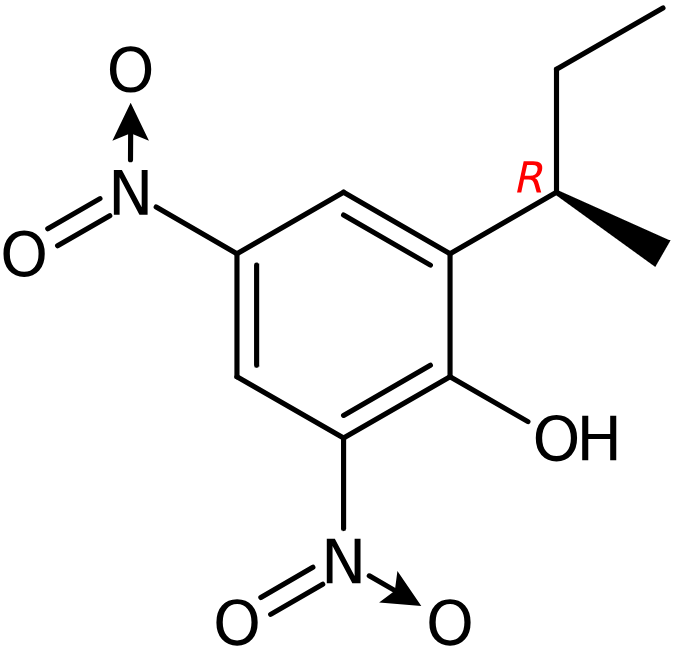

{ width=150px }

The compound has the SMILES
`CC[C@@H](C)C1=CC(=CC(=C1O)[N+](=O)[O-])[N+](=O)[O-]`
and
`InChI=1S/C10H12N2O5/c1-3-6(2)8-4-7(11(14)15)5-9(10(8)13)12(16)17/h4-6,13H,3H2,1-2H3/t6-/m1/s1`.

|  |  |
| -------- | -------- |
| Molecular formula | C10H12N2O5 |
| Mass | 240.074621 dalton |
| InChIKey | OWZPCEFYPSAJFR-ZCFIWIBFSA-N |

# Identifiers

|  |  |
| -------- | -------- |
| ChEBI | [83633](https://www.ebi.ac.uk/chebi/searchId.do?chebiId=CHEBI:83633) |
| PubChem [@Kim2022PubChem] | [688400](https://pubchem.ncbi.nlm.nih.gov/compound/688400) |

## Identifiers from Wikidata

|  |  |
| -------- | -------- |
| ChemSpider | [599866](https://www.chemspider.com/Chemical-Structure.599866.html) |
| Reaxys | 3211810 |
| UniChem | [19888404](https://www.ebi.ac.uk/unichem/compoundsources?compound=19888404) |

## Other collections

The compound can be listed in other collections. These are listed here.

|  |  |
| -------- | -------- |
| VHP4Safety Case Study 2 compounds | [Q5050](http://compoundcloud.wikibase.cloud/entity/Q5050) |

# Properties

From PubChem we get XLogP3 [@Cheng2007Computation]:

|  |  |  |
| -------- | -------- | -------- |
| XLogP3 | 3.6 | computed |

# Metabolism

No metabolism is recorded.

## WikiPathways 

No biological pathways are recorded.

## Site-of-Metabolism

Foo bar.

# Acknowledgments

This report is generated by solutions developed by VHP4Safety [@Kienhuis2024Virtual].
It is compound is registered in the VHP4Safety Compound Wiki as
[Q4725](http://compoundcloud.wikibase.cloud/entity/Q4725).

## References
